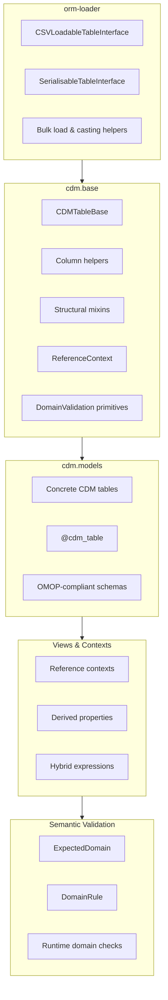

# Layered Architecture

OMOP Alchemy is built as a **deliberately layered system**.

Each layer adds capability while preserving the guarantees of the layer below it.
Responsibilities flow *downward*; semantic intent flows *upward*.

The result is a system that is:

- composable
- inspectable
- safe for both ETL and analytics

---

## The Layer Stack

### Layer responsibilities

#### orm-loader (L0)

Purpose: ingestion and infrastructure

This layer provides:

* CSV loading
* bulk inserts
* type casting
* serialization helpers

It is deliberately domain-agnostic.

If something understands OMOP concepts, vocabularies, or clinical meaning, it does not belong here.

Examples:

* [CSVLoadableTableInterface](https://australiancancerdatanetwork.github.io/orm-loader/loaders/)
* [SerialisableTableInterface](https://australiancancerdatanetwork.github.io/orm-loader/tables/serialisable_table/)

#### cdm.base (L1)

Purpose: structural OMOP semantics

This layer encodes:

* common OMOP table structure
* column patterns (required vs optional)
* reusable mixins
* reference relationship mechanics
* domain validation primitives

This is where OMOP’s shape lives, but not its analytical meaning.

Examples:

* [CDMTableBase](./base.md)
* [PersonScoped](./columns.md)
* [ReferenceContext](./relationships.md)

This layer answers:

“What does a valid OMOP table look like?”

#### cdm.models (L2)

Purpose: concrete OMOP tables

This layer defines:

* actual CDM tables
* exact column layouts
* primary keys and foreign keys
* official OMOP schemas

Classes in this layer:

* are safe for ETL
* are safe for bulk loading
* avoid eager relationships
* avoid analytical helpers

Examples:

[Person](../models/clinical/person.md)

#### Views & Contexts (L3)

Purpose: navigation and analysis

This layer adds:

* reference relationships
* derived properties
* hybrid expressions
* query-friendly helpers

Examples:

[PersonContext](../models/clinical/person.md)
[PersonView](../models/clinical/person.md)

Views are designed for interactive use, not ingestion.

> *Tables are for pipelines. Views are for people.*

#### Semantic Validation (L4)

Purpose: make semantic expectations explicit

This layer introduces:

* declared domain expectations
* inspectable rules
* runtime, advisory checks

Examples:

[ExpectedDomain](../validation/index.md)

This layer answers:

> “Does this object reference the kinds of concepts I think it does?”

Validation here is:

* non-blocking
* non-mutating
* safe to skip
* safe to run interactively

### Directional guarantees

The stack is intentionally one-directional:

* lower layers never import higher layers
* ETL code never depends on analytical helpers
* validation never mutates state

This guarantees:

* predictable ingestion
* expressive analysis
* minimal coupling
* documentation that stays aligned with code

### Why this separation matters

Implementations that collapse these concerns into a single ORM layer will tend to produce:

* accidental joins in ETL
* brittle analytical code
* hard-to-debug semantics
* documentation drift
